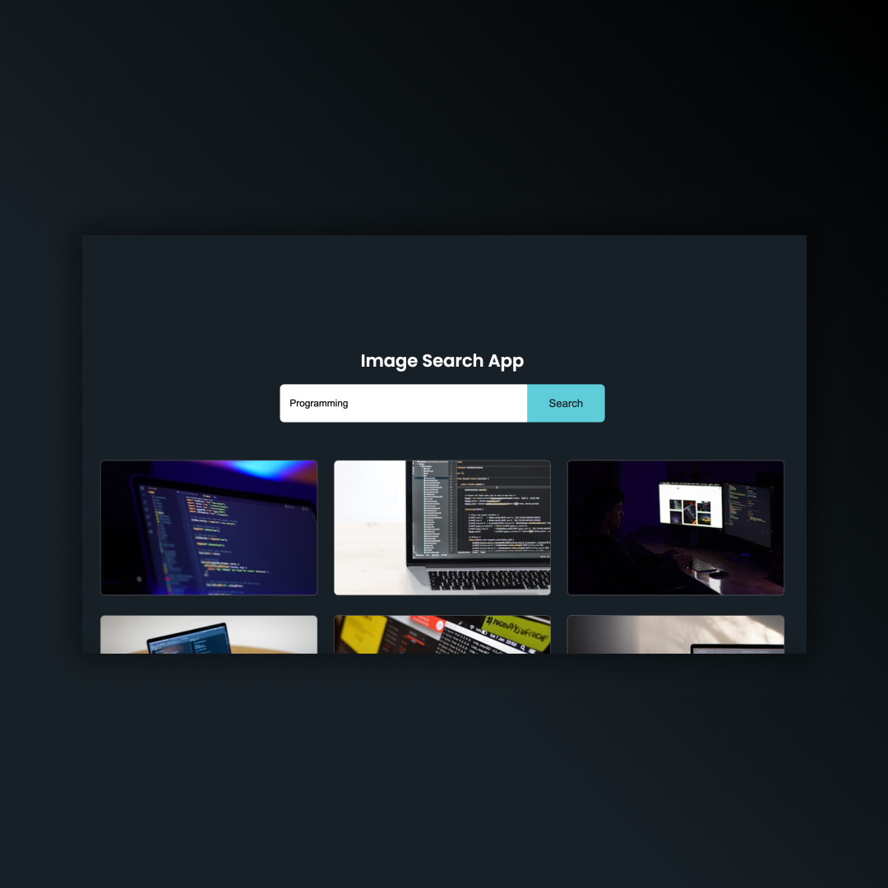
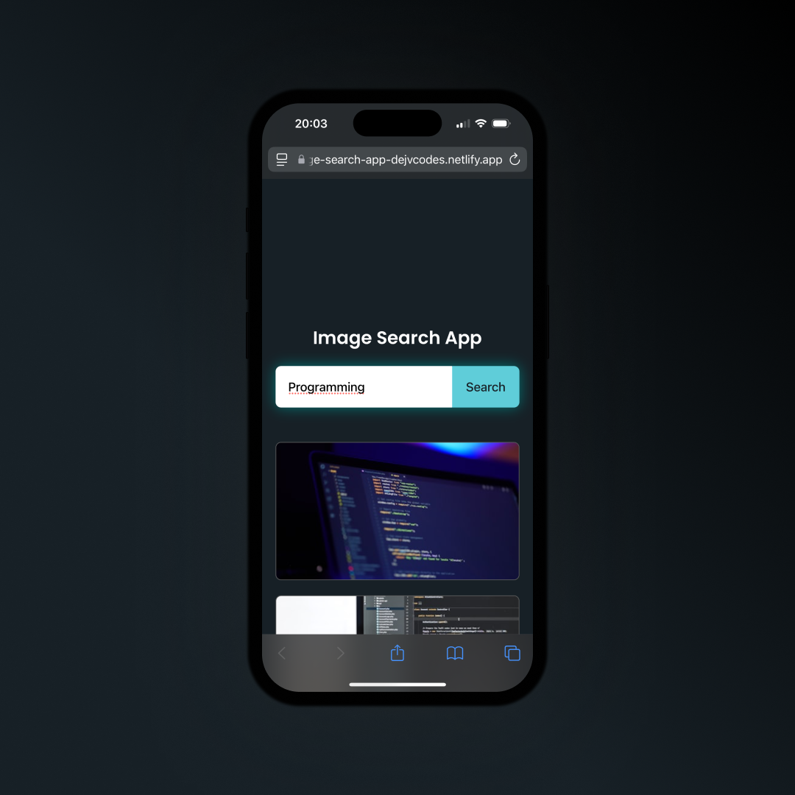

## Image Search App 
• HTML, CSS & JavaScript   
• Fetch and display Images from API using JavaScript  
• Responsive Design 

## Screenshots 📱
 

## 💻 Tech Stack

## 🌐 Link
<a href="https://image-search-app-dejvcodes.netlify.app/">Image Search App</a>

## License 🔐
[MIT License](LICENSE) 
